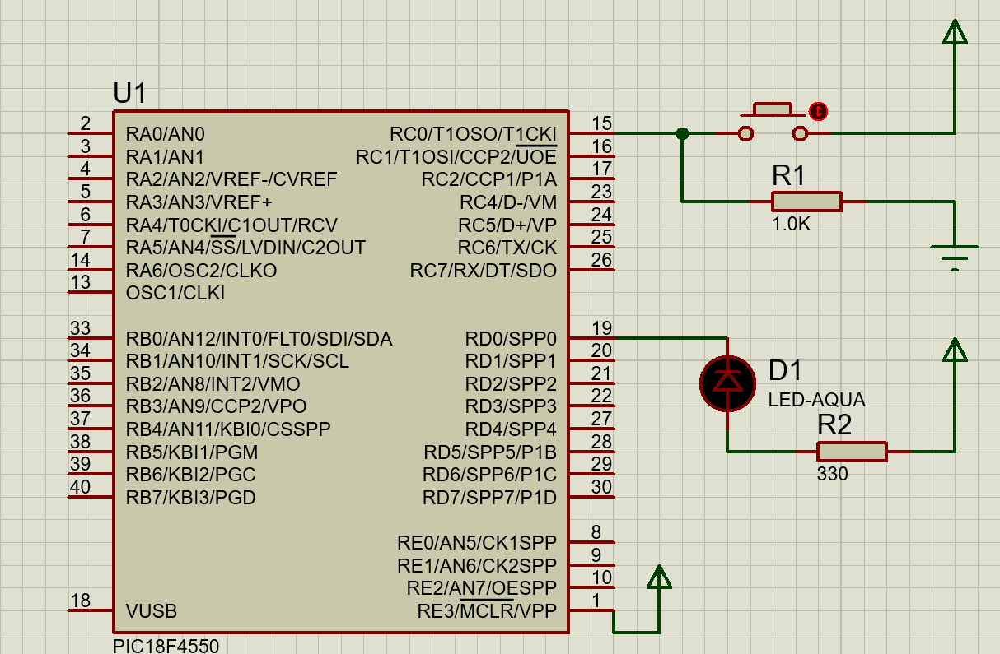
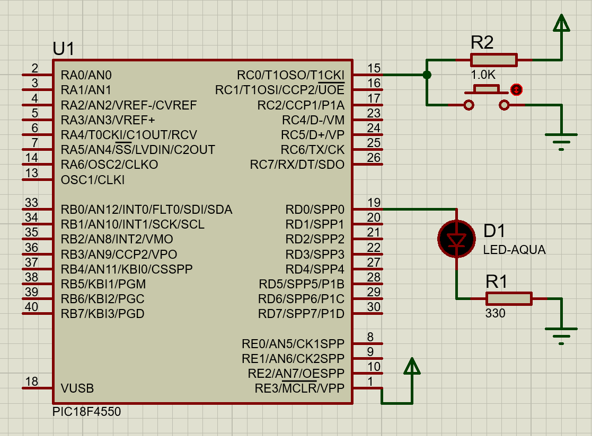

### Theory
The PIC18 series microcontroller is a popular microcontroller family that is commonly used in various embedded systems applications due to its low power consumption and ease of programming. The GPIO (General Purpose Input Output) pins of a microcontroller are used to connect external devices such as LEDs, switches, sensors, etc. In this experiment, we will be using a push button switch to control the blinking of an LED connected to a GPIO pin of the PIC18 microcontroller.

When the push button switch is pressed, the input pin of the microcontroller is pulled high. The microcontroller's program then detects the change in state of the input pin and toggles the output pin connected to the LED, thereby turning it on. When the push button switch is released, the input pin returns to its initial state, and the microcontroller program detects this and turns off the LED. 

To implement this functionality, we will use the programming language C. The program will be written to continuously monitor the state of the input pin and toggle the state of the output pin based on the state of the input pin.

Overall, this experiment will demonstrate the fundamental concept of interfacing a push button switch with a microcontroller and controlling an LED's blinking. This concept can be further extended to implement various applications such as controlling motors, sensors, and other electronic devices.

Now, for programming the inputs and outputs of PIC series microcontroller. For setting the peripheral to input and output, the necessary registers are PORTx, LATx, and TRISx.

Let's consider an example for PORT A:

PORTA is an 8-bit wide, bidirectional port. The corresponding Data Direction register is TRISA. Setting a TRISA bit (= 1) will make the corresponding PORTA pin an input (i.e., put the corresponding output driver in a high-impedance mode). Clearing a TRISA bit (= 0) will make the corresponding PORTA pin an output (i.e., put the contents of the output latch on the selected pin)

The Data Latch register (LATA) is also memory mapped. Read-modify-write operations on the LATA register read and write the latched output value for PORTA.

### Schematic
Components used in simulation:
-	Microcontroller: PIC18F4550
-	Aqua color LED
-	Resistor: 330 Ohms
-	Pushbutton

In this Example schematic, the push button is connected to pin RC0 of PORT C and LED is connected across RD0 of the PORT D of the microcontroller.

### Current Sinking Operation

Fig: LED (Current Sink) and switch (press to high interfacing with microcontroller) 

In the current Sinking Operation, Current flows into the device. In this method, the Button is PUSHED-TO-HIGH and LED starts blinking. 

### Current Sourcing Operation

Fig: LED (current sourcing) and switch (press to low interfacing with microcontroller)

In the current Sourcing Operation, Current flows out of the device. In this method, the Button is PUSHED-TO-LOW and starts blinking.

